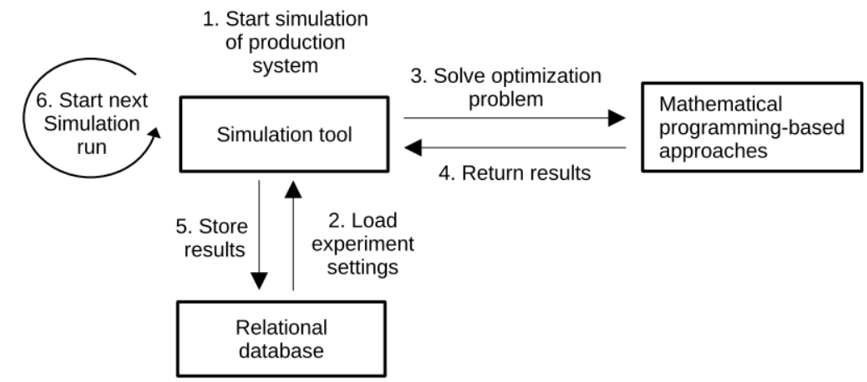

# Simulation-Optimization Framework for Production Planning

## Simulation Framework
The framework provides a structured environment to analyze the impact of different parameter settings when applying Materials Requirements Planning (MRP). A set of generated test scenarios illustrates how various configurations influence production performance, along with guidance on interpreting the computed results.

## Features
- **Flexible Testing**: Users can experiment with various planning parameter values without modifying production processes.
- **Standard Planning Approaches**: Supports well-established methodologies such as MRP combined with optimization techniques.
- **Open-Source Implementation**: Enables reproducibility and adaptability for academic and industrial applications.
- **Configurable Test Instances**: Offers predefined production system test cases or allows integration with external production system structures.

## Simulation-Optimization Framework Architecture
The software architecture is designed to integrate discrete-event production simulation with mathematical optimization. It consists of three core components:
- **Simulation Tool**: Used to model production processes, including queues, delays, and order flows.
- **Optimization Component**: Supports mathematical programming-based approaches to enhance decision-making.
- **Relational Database**: Stores parameters, simulation results, and performance metrics.

The architecture is modular and scalable, supporting standalone and distributed experiments. In a distributed setup, multiple clients execute simulations in parallel, each selecting and storing results in a central database. This setup is particularly beneficial for large-scale parameter experiments.

For implementation, **AnyLogic** was selected for simulation, **CPLEX** for optimization, and **SQLite** as the database. These choices were based on technical capabilities, prior research experience, and industry feedback. The SQLite database ensures compatibility with open-source tools while allowing efficient data storage and retrieval. While alternative solutions exist (e.g., SimPy, Arena, Gurobi), a comparative analysis was beyond the project's scope. The framework is open-source, allowing researchers to adapt it with alternative technologies as needed.

## Simulation Process
The following diagram illustrates the key steps involved in a simulation run:

The selected simulation software must be capable of modeling production systems with queues, delays, dynamic events, and other process and logical components. The production system simulation process should support demand fluctuations, order queues, process delays, order releases, varying machine utilization, and stock booking behavior dynamically during the simulation runtime.

The simulation process begins by setting static scenario parameters, which remain unchanged throughout the run. Stochastic and planning parameters, however, can be dynamically adjusted between iterations or replications. After initialization, the process follows these key steps:
- **Demand Generation**: The simulation starts with generating demand based on predefined distributions or cyclic updates.
- **Production Planning**: The system plans production based on the latest demand updates and rolling horizon shifts.
- **Order Release and Shop Floor Processing**: Orders are released into the system and processed, considering delays and varying utilization levels.
- **Stock Keeping and Delivery**: Processed orders are stored in inventory or delivered, depending on demand requirements.

A critical component is the integration of demand updates and rolling horizon shifts, ensuring continuous adaptation to new information. Demand updates can follow predefined cyclic patterns (e.g., forecast updates) or stochastic distributions (e.g., log-normal arrival rates). Rolling horizon adjustments ensure that future demand periods are incorporated into production planning, mitigating the risk of system overload or underutilization.

To effectively evaluate production behavior, the framework computes key performance indicators (KPIs) such as costs, inventory levels, and tardiness. KPIs are computed using both discrete and continuous statistical methods, with warm-up phase statistics excluded from the final analysis. Stochastic effects, particularly in demand generation and shop floor processing, are introduced using suitable probability distributions to reflect real-world uncertainty.

## Get Started with SimOpt
1. Clone the repository.
2. To view the simulation model download and install Anylogic Personal Learning Edition from https://www.anylogic.com/downloads/ and open the alp file from the repository.
3. The properties.config file is used to set the path to the sqlite and postgre sql instances.
4. The simopt.db file must be in read and write access of the simulation model. Easiest way is to leave it in the same directory as the alp file is located.
  4.1 To view and edit the sqlite database, we recommend the usage of DB Browser for Sqlite (https://sqlitebrowser.org/)
  4.2 To view and edit the sqlite and postgresql, we recommend the usage of DB Beaver Community Edition (https://dbeaver.io/)
5. The postgresql database is usually used for large experiments where individual instances of the simulation model are pulling the parameterizations to the own instance and update the processed parameter and storing the KPIs into the result table.
7. To analyse the simualtion results use the above recommended SQL tools.

## Project Website
The development of the simulation framework was part of the Austrian Science Fund granted project "Hybrid Algorithms for Redesigning MRP", please visit the [project website](https://coe-sp.fh-ooe.at/projekte/hybrid-algorithms-for-redesigning-mrp/) for more details.

## License
This project is licensed under the MIT License.

